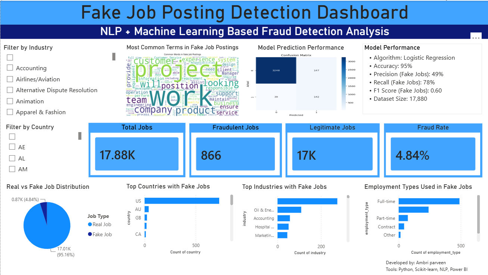

# 🚨 Fake Job Posting Detection Dashboard

## 📌 Overview

This project uses Natural Language Processing (NLP) and Machine Learning to detect fraudulent job postings and visualize key insights through an interactive Power BI dashboard.

## 🎯 Objectives

- Detect fake job postings using Machine Learning.
- Analyze fraudulent job trends.
- Identify high-risk industries and countries.
- Visualize insights using Power BI.

## 🛠️ Tech Stack

### Programming & Analytics
- Python
- Pandas
- NumPy

### Machine Learning & NLP
- Scikit-learn
- TF-IDF Vectorization
- Logistic Regression

### Visualization
- Matplotlib
- Seaborn
- WordCloud
- Power BI
  
---

## 📊 Dataset Information

- Source: Kaggle Fake Job Postings Dataset
- Total Records: 17,880 Job Postings
- Target Variable: `fraudulent`

---

## ⚙️ Machine Learning Workflow

### Data Preprocessing
- Handled missing values
- Combined title, description, and requirements
- Performed text preprocessing

### Feature Engineering
- TF-IDF Vectorization
- Maximum Features: 5000

### Model Training
- Algorithm: Logistic Regression
- Train-Test Split: 80:20

---

## 📈 Model Performance

| Metric | Value |
|----------|----------|
| Accuracy | 95% |
| Precision (Fake Jobs) | 49% |
| Recall (Fake Jobs) | 78% |
| F1 Score (Fake Jobs) | 0.60 |

---

## 📊 Dashboard Features

### KPI Cards
- Total Jobs
- Fake Jobs
- Real Jobs
- Fraud Rate

### Visualizations
- Real vs Fake Job Distribution
- Top Countries with Fake Jobs
- Top Industries with Fake Jobs
- Employment Types Used in Fake Jobs
- Fake Job Word Cloud
- Model Confusion Matrix

### Interactive Filters
- Industry Filter
- Country Filter

---

## 🔍 Key Insights

- Fraudulent job postings represent only 4.84% of the dataset.
- Oil & Energy has the highest number of fake job postings.
- The United States contributes the majority of fraudulent listings.
- Full-time positions are the most commonly used employment type in fake job advertisements.

---

## Repository Structure

```text
Fake-Job-Posting-Detection/
│
├── Fake_Job_Posting_Detection.ipynb
├── fake_job_posting_graphs.ipynb
├── fake_job_model.pkl
├── classification_report.txt
├── dashboard_preview.png
├── confusion_matrix.png
├── top_fake_countries.png
├── top_fake_industries.png
├── wordcloud.png
├── README.md
```



## 🚀 Future Improvements

- Deploy as a web application.
- Use advanced NLP models such as BERT.
- Real-time fake job detection.
- Automated fraud alert system.

---

## 👨‍💻 Author

Ambri Parveen

### Tools Used

Python • NLP • Machine Learning • Scikit-learn • Power BI • Data Visualization
